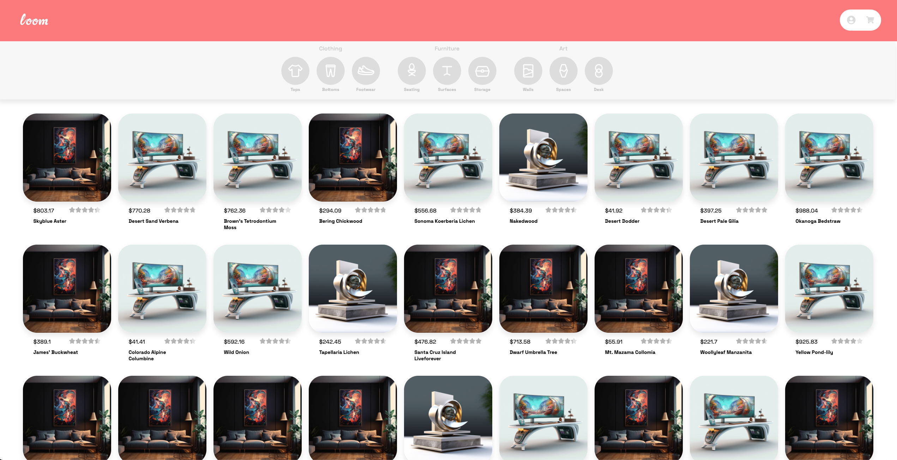
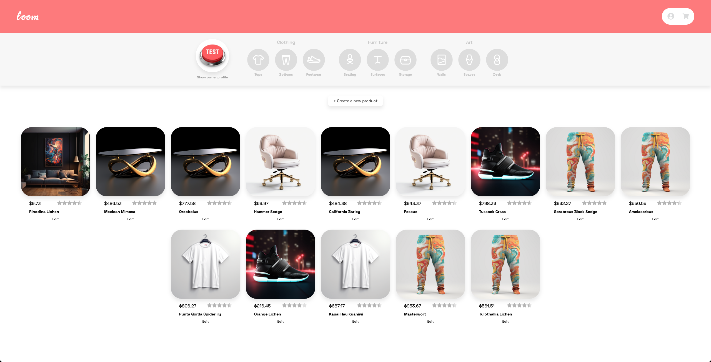
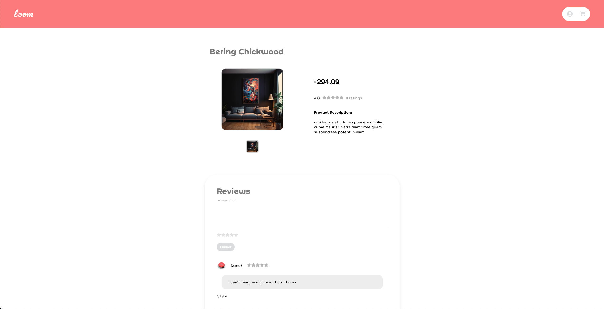

# Loom

Loom is an e-commerce site that enables selling products p2p.

[Click here for live view of site.](https://gather.city)

# Wiki Links
  * [API Documentation](https://github.com/cgrq/Loom/wiki/API-Documentation)
  * [Database Schema](https://github.com/cgrq/Loom/wiki/Database-Schema)
  * [Feature List](https://github.com/cgrq/Loom/wiki/Features)
  * [User Stories](https://github.com/cgrq/Loom/wiki/User-Stories)
  * [Wireframes](https://github.com/cgrq/Loom/wiki/Wireframes)
  * [Redux Store Shape](https://github.com/cgrq/Loom/wiki/Redux-Store-Shape)

# Tech Stack


# UI

## Homepage



## Storefront Page



## Product Page



# Running project locally

## Step 1 (Run backend)

* Install python dependencies by running the `pipenv install -r requirements.txt` command.

* Install node dependencies by running the `npm install --prefix frontend`

* Make sure to create a `.env` file by following the `.env.example` given.

* Set up database by running the following commands:

   ```
   pipenv shell
   flask db upgrade
   flask seed all
   ```

* Start backend server by running the `flask run` command.

* Start frontend server by running the following commands:
   ```
   cd frontend
   npm start
   ```

# Contact

Feel free to message me on [LinkedIn](https://www.linkedin.com/in/c--r/)!
